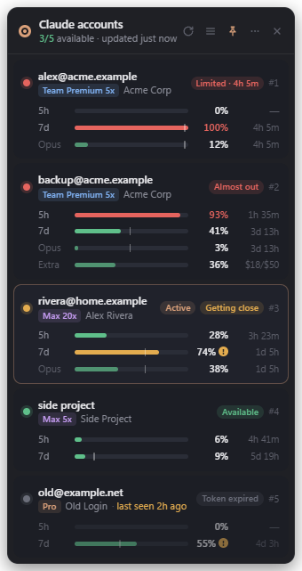
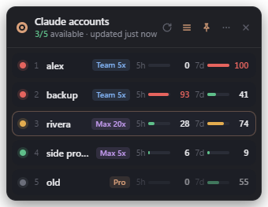

# cswap UI

A small, always-on-top desktop widget that shows the usage limits of every Claude account you manage with [cswap (claude-swap)](https://github.com/realiti4/claude-swap), so you can see at a glance which accounts are close to their limits without running `cswap list` over and over.

<p align="center">
  
  
</p>

<sub>Screenshots use the built-in demo data (`npm run demo`), not real accounts.</sub>

## Features

- **Every account at a glance.** 5-hour and 7-day windows, per-model weekly limits, and extra-usage spend, each with a live countdown to reset.
- **Clear status.** Each account is marked Available, Getting close (70%+), Almost out (90%+) or Limited, with when it frees up.
- **Plan badges.** Shows Max 5x/20x, Team Premium 5x / Standard 1x, Pro or Enterprise, read from cswap's per-account config.
- **Pace hints.** A tick on weekly bars marks where even usage would be right now, and a `!` flags windows cswap projects will run out before they reset.
- **Stays out of the way.** Frameless, dark, draggable, and remembers its position. Has a compact mode, a tray icon, and an option to start at login.
- **Privacy mode.** Replaces account identities with slot labels such as “Account 1” in both views, including hover text.
- **Read-only.** It runs `cswap list --json` and reads the account-info block of cswap's config snapshots. It never opens credential files or changes anything.

## Requirements

- [cswap](https://github.com/realiti4/claude-swap) 0.26 or newer, with at least one account added
- [Node.js](https://nodejs.org/) 22 or newer
- Windows, macOS or Linux (developed and tested on Windows 11)

## Getting started

```sh
git clone https://github.com/ExileStudios/cswap-ui.git
cd cswap-ui
npm install
npm start
```

The widget opens in the top-right corner of your primary display. Drag it by the header to move it.

On Windows you can also double-click `scripts/start-hidden.vbs` to launch it without a console window. To run it automatically, turn on **Start at login** from the tray menu.

> **npm 11+ blocked Electron's install script?** Run `npm approve-scripts electron`, then `npm install` again. Electron downloads its binary during install.

To try the UI without cswap, run `npm run demo`.

## Reading the widget

| Element | Meaning |
| --- | --- |
| Dot and status pill | Green: available. Amber: a 5h or 7d window is at 70% or more. Red: 90% or more, or **Limited** with the time until it frees up. Grey: cswap couldn't read usage (for example, an expired token). |
| **Active** | The account Claude Code is currently logged in as. |
| `5h` / `7d` bars | The shared 5-hour and 7-day windows. Only these decide whether an account is usable. |
| Model bars (e.g. `Opus`) | Per-model weekly limits. They only block that model, so they don't mark the account Limited. |
| `Extra` | Pay-as-you-go extra usage spent this month, against its limit. |
| White tick | Where the bar would be if you used the window evenly. |
| `!` | cswap projects that window will run out before it resets. |
| `last seen 2h ago` | Live usage couldn't be fetched, so the last good measurement is shown, dimmed. |

## Controls

- **Header buttons:** refresh, compact view, always on top, menu, hide.
- **Tray icon:** click to show or hide. The menu has the refresh interval (30 seconds to 5 minutes, default 1 minute), start at login, reset position and quit.

Polling pauses while the widget is hidden and resumes when it's shown or the computer wakes from sleep.

### Privacy mode

Open **More options (⋯) → Privacy mode**, or enable it in the tray menu, before sharing your screen. Accounts appear as **Account 1**, **Account 2**, etc., using their cswap slot numbers. Emails, aliases, and organization names are hidden in both full and compact views, including tooltips. Plan badges, usage, and active-account indicators remain visible.

The preference is saved across restarts and is off by default. Toggling it updates the current view immediately, without waiting for a refresh. Raw CLI error details are also hidden while it is on. This only changes the widget's presentation; it does not modify cswap's stored accounts or hide identities in other applications.

## Configuration

| Environment variable | Default | Purpose |
| --- | --- | --- |
| `CSWAP_PATH` | `~/.local/bin/cswap(.exe)`, then `cswap` on `PATH` | cswap executable |
| `CSWAP_BACKUP_DIR` | Same as cswap: `~/.claude-swap-backup` on Windows and macOS, `$XDG_DATA_HOME/claude-swap` on Linux | Where plan badges are read from |

Settings (position, view, interval) are saved in the Electron user-data folder, for example `%APPDATA%\cswap UI\settings.json` on Windows.

## Development

```sh
npm run check        # lint + tests
npm run demo         # run with fictional data
npm run screenshots  # regenerate docs/*.png from demo data
```

```
src/
  main/        Electron main process: window, tray, polling, IPC, cswap reader
  renderer/    UI: plain HTML, CSS and ES modules, no framework
  shared/      Pure usage logic, used by both processes
  preload.cjs  The narrow API exposed to the page
test/          node:test unit tests
```

### Security model

- The renderer is sandboxed with context isolation, and has no Node.js access. It only gets a small preload API, and every IPC message is checked against the app's own window and page.
- A strict Content Security Policy is applied, with no inline scripts or styles. The UI builds DOM nodes directly, so cswap output is never parsed as HTML.
- Navigation, new windows, webviews and all permission requests are denied.
- cswap is run with `execFile` (no shell), a timeout and an output size limit. Snapshot file names are validated so they can't leave cswap's config directory.

## Credits

Built on top of [claude-swap](https://github.com/realiti4/claude-swap) by Onur Cetinkol. This project isn't affiliated with Anthropic or the cswap project.

## License

[MIT](LICENSE)
